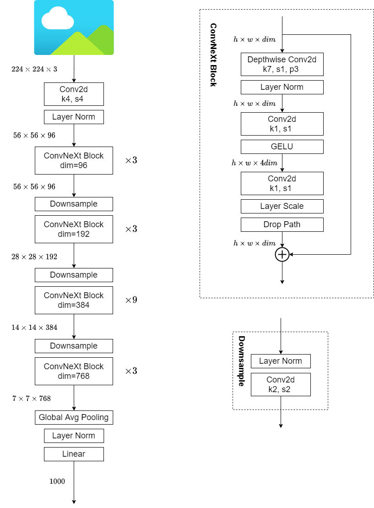
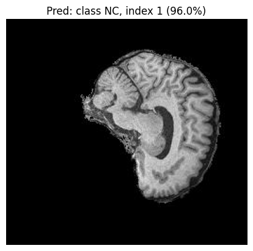
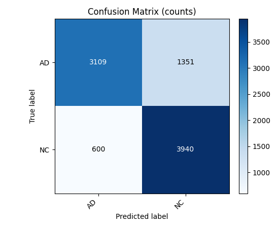

# Classifier for ADNI brain data based on the ConvNeXt

**Table of Contents**
  - [Model and Problem Description](#model-and-problem-description)
  - [Model Architecture](#model-architecture)
  - [About the Dataset](#about-the-dataset)
  - [Usage](#usage)
  - [Results](#results)
  - [References](#references)

## Model and Problem Description
This repository contains the implementation code of ConvNeXt. The ConvNeXt model is a pure convolutional network developed by adapting the ResNet50 architecture with design principles inspired by the Swin Transformer. It has strong general-purpose visual representation capabilities and is widely used in tasks such as classification, detection, segmentation and medical image transfer learning.  
The data is sourced from ADNI. This dataset contains many sliced MRI brain scan images labeled as Alzheimer's disease (AD) and normal control (NC).  
Based on the ConvNeXt network，this project identified Alzheimer's disease from 2D MRI  brain scans and ultimately achieved an accuracy of 78.3% on the validation set .  

## Model Architecture
The ConvNeXt network adopts the hierarchical residual macro-framework of ResNet while implementing systematic architectural refinements.  

- **Change the stage compute ratio**: Adjusted the stack count of ResNet-50 from (3,4,6,3) to (3,3,9,3), and replaced the stem with a convolution of 4×4 / stride=4 for initial downsampling.  
- **Patchify Stem**: Replace the traditional ResNet's 7×7 conv + maxpool with non-overlapping 4×4 convolution, directly patchifying and downsampling the image.  
- **Depthwise convolution**: Employed depthwise convolution with groups equal to channels to reduce the computational load while expanding the effective receptive field.  
- **Inverted Bottleneck and "Uplifted" DWConv**: Restructured the internal block to depthwise conv → 1×1 → 1×1, corresponding to moving the DWConv in the MobileNetV2 type inverted bottleneck to the front.  
- **Larger convolution kernels**: Increased the kernel size of depthwise conv within the block from 3×3 to 7×7.  
- **Activation Function ReLU → GELU**: Retained only one GELU between two 1×1 convolutions.  
- **Normalization BN → LN**: Retained LayerNorm only once within a block (the implementation was LayerNorm2d of NCHW).  
- **Independent downsampling layer**: Replaced residual blocks with stride between stages with dedicated downsampling layers with LN → 2×2 / stride=2 convolution, uniformly handling resolution changes.  

The model architecture is as follows:   


ConvNeXt starts with a patchify stem, stacks ConvNeXt blocks containing depthwise convolutions and lightweight normalization or activation, and gradually downsamples via independent downsampling layers. Finally, it completes recognition through global average pooling followed by a linear classifier.  

## About the Dataset
ADNI (Alzheimer's Disease Neuroimaging Initiative) is a public dataset for Alzheimer's disease research. This project utilizes the T1-weighted structural MRI (T1w MRI) images, along with clinical labels for AD (Alzheimer's disease) and NC (normal control).  

Data can be accessed and downloaded via the following link:  
https://adni.loni.usc.edu/data-samples/adni-data/  

The specific directory structure of the dataset required for this project will be detailed in the Usage section.  

## Usage 
### Files Description
1. modules.py containing the source code of the components of ConvNeXt model.   
2. dataset.py containing the data loader for loading and preprocessing ANDI dataset.   
3. train.py containing the source code for training, validating, testing and saving the model.   
4. predict.py showing example usage of the trained model.   
5. README.md to sufficiently document the project.  
6. images/ containing figures and files used in README.  
   
### Dependencies
The following are the required dependencies for this project:  
| Dependencies | Version | 
| :-----: | :-----: | 
| Python       | 3.9 |  
| torchvision  | 0.22.1+cu118 | 
| torch        | 2.7.1+cu118 | 
| numpy        | 2.1.2 | 
| scikit-learn | 1.7.1 | 
| matplotlib   | 3.10.5 | 
| pillow       | 11.0.0 | 
| tqdm         | 4.67.1 | 

### Dataset Structure
The default data directory of this model has completed the division between the training set and the validation set.  
The specific structure of the dataset is as follows:  
```
AD_NC  
├── train  
│   ├── AD  
│   │   ├── 218391_78.jpeg  
│   │   ├── ...│  
│   └── NC  
│       ├── 808819_88.jpeg  
│       ├── ...│  
└── validation  
    ├── AD  
    │   ├── 388206_78.jpeg  
    │   ├── ...│  
    └── NC  
        ├── 1182968_94.jpeg  
        ├── ...  
```

### Training
The following are the configuration parameters required for model training:  
| Argument | Description | Type | Default |
| ----- | ----- | ----- | ----- |
| `--data_root`               | Root directory of the dataset, e.g., .../root/AD_NC | `str` | Required |
| `--img_size`                | Input resolution | `int` | `448` |
| `--num_classes`             | The number of output categories | `int` | `2` |
| `--drop_path_rate`          | Stochastic Depth (DropPath) rate | `float` | `0.1` |
| `--dropout_rate`            | Dropout probability in the classification head | `float` | `0.2` |
| `--weight_decay`            | Weight decay (L2 regularization) | `float` | `0.07` |
| `--label_smoothing`         | Label Smoothing factor for cross-entropy (set to `0` to disable) | `float` | `0.1` |
| `--batch_size`              | The number of samples per training iteration | `int` | `64` |
| `--epochs`                  | The number of training epochs | `int` | `50` |
| `--lr`                      | Initial learning rate | `float` | `1.5e-4` |
| `--out_dir`                 | Output directory |  `str` | `runs` |
| `--num_workers`             | The number of DataLoader workers | `int` | `0` |
| `--samples_per_class_train` | Number of samples to draw per class (for debugging; `None` to use all) | `int / None` |   `None` |
| `--seed`                    | Random seed | `int` | `42` |
| `--patience`                | Early stopping patience (set `0` to disable) |  `int` | `10` |
| `--target_acc`              | Early stopping target (set `0` to disable) | `float` | `0.8` |
| `--min_delta`               | Minimum delta for improvement | `float` | `1e-3` |
| `--mixup_alpha`             | MixUp coefficient (set `0` to disable) | `float` | `0.2` |

An example command is provided below:  
```bash
python train.py --data_root root/AD_NC --drop_path_rate 0.2 --dropout_rate 0.3 --lr 1e-4 --epochs 200 --batch_size 64 --num_workers 8 --patience 0 --mixup_alpha 0  
```

Three types of optimal checkpoints will be saved during training:  
(1) the highest validation accuracy (at a 0.5 threshold);  
(2) the highest validation AUC;  
(3) the highest accuracy after threshold tuning based on the ROC curve.  

### Predictions
The following are the configuration parameters required for predicting: 
| Argument | Description | Type | Default |
| ----- | ----- | ----- | ----- |
| `--ckpt`        | Path to the model weights, e.g., runs/best_acc_tuned.pth | `str` | Required |
| `--data_root`   | Directory of the dataset; used during batch evaluation, must contain subfolders `--split`  | `str` | `None` |
| `--split`       | The subdirectory under `data_root` for evaluation, e.g., `validation`/`test` | `str` | `validation` |
| `--image`       | Path for single-image inference | `str` | `None` |
| `--batch_size`  | Batch size for folder-based evaluation | `int` | `64` |
| `--num_workers` | The number of DataLoader workers | `int` | `0` |
| `--device`      | Device for Inference | `str` | `cuda` |
| `--save_dir`    | Output directory | `str` | `pred_out` |

Example commands are provided below:   
Single image prediction: 
```bash 
python predict.py --ckpt runs5/best_acc_tuned.pth --data_root "root/AD_NC" --split validation --image "root/AD_NC/validation/NC/1182968_94.jpeg"  
```
Batch prediction (Folder):  
```bash
python predict.py --ckpt runs/best_acc_tuned.pth --data_root "root/AD_NC" --split validation  
```

## Results
### Training
Training loss kept decreasing, with accuracy and AUC approaching 1.00. Validation AUC and accuracy rose rapidly within the first 20–40 epochs. However, validation loss consistently increased and remained around ≈ 0.8–0.9, showing a clear divergence from the training loss, which indicates suboptimal calibration or mild overfitting due to high-confidence misclassifications. However, the model's separability did not degrade, as the AUC remained stable.  

In summary, the model achieved stable discriminative ability on the validation set (AUC ≈ 0.85) and a threshold-optimized accuracy (≈ 0.78), while further extending training did not yield additional gains.  

Training logs are available at: [images/train.out](images/train.out).   

The training configuration is as follows:  
| Argument | Value |
| ----- | ----- |
| `--data_root`               | `root/AD_NC` |
| `--img_size`                | `448` |
| `--num_classes`             | `2` |
| `--drop_path_rate`          | `0.2` |
| `--dropout_rate`            | `0.3` |
| `--weight_decay`            | `0.07` |
| `--label_smoothing`         | `0.1` |
| `--batch_size`              | `64` |
| `--epochs`                  | `200` |
| `--lr`                      | `1e-4` |
| `--out_dir`                 | `runs` |
| `--num_workers`             | `8` |
| `--samples_per_class_train` | `None` |
| `--seed`                    | `42` |
| `--patience`                | `0` |
| `--target_acc`              | `0.8` |
| `--min_delta`               | `1e-3` |
| `--mixup_alpha`             | `0` |
```bash
python train.py --data_root root/AD_NC --img_size 448 --num_classes 2 --drop_path_rate 0.2 --dropout_rate 0.3 --weight_decay 0.07 --label_smoothing 0.1 --batch_size 64 --epochs 200 --lr 1e-4 --out_dir runs --num_workers 8 --samples_per_class_train None --seed 42 --patience 0 --target_acc 0.8 --min_delta 1e-3 --mixup_alpha 0  
```
Optimization methods used in training:  
1. Drop Path (Stochastic Depth)  
2. Mixup  
3. Label Smoothing  
4. Optimizer: AdamW  
5. Learning Rate Scheduling (Cosine + Warmup)  
6. Early Stopping  
7. Calibration and Threshold Tuning  

The dataset is considered relatively class-balanced; therefore, class weighting or resampling techniques were not applied. Despite implementation of the above strategies, the validation accuracy remains slightly below 0.80, with observed overfitting and calibration bias. This represent key directions for future optimization.

### Predictions
Inference and Prediction using the trained checkpoint are demonstrated as follows. The inference process employs the same Resize/Normalize pipeline as during training to ensure input distribution consistency.

 
Example prediction on a single image (displaying predicted probability and class)
 
Confusion matrix for the validation and test set

The inference configuration is as follows: 
| Argument | Value |
| ----- | ----- |
| `--ckpt`        | `runs/best_acc_tuned.pth` |
| `--data_root`   | `root/AD_NC` |
| `--split`       | `validation` |
| `--image`       | `root/AD_NC/validation/NC/1182968_94.jpeg` |
| `--batch_size`  | `64` |
| `--num_workers` | `0` |
| `--device`      | `cuda` |
| `--save_dir`    | `pred_out` |

Single image prediction:   
```bash
python predict.py --ckpt runs/best_acc_tuned.pth --data_root root/AD_NC --split validation --image root/AD_NC/validation/NC/1182968_94.jpeg --batch_size 64 --num_workers 0 --device cuda --save_dir pred_out  
```
Batch prediction (Folder):   
```bash
python predict.py --ckpt runs/best_acc_tuned.pth --data_root root/AD_NC --split validation --batch_size 64 --num_workers 0 --device cuda --save_dir pred_out  
```

## References
### Course & Report
[1] Pattern Recognition (COMP3710) – Course Report Material, Shekhar “Shakes” Chandra, Version 1.64 Final, The University of Queensland, 2025.  
### Paper  
[2] Z. Liu, H. Mao, C.-Y. Wu, C. Feichtenhofer, T. Darrell, and S. Xie, “A ConvNet for the 2020s,” arXiv preprint arXiv:2201.03545 [cs], Mar. 2022. [Online]. Available: http://arxiv.org/abs/2201.03545  
### Online Resources
[3] CSDN Blog: “ConvNeXt Architecture,” [Online]. Available: https://blog.csdn.net/qq_42076902/article/details/124529390  
[4] Zhihu: “ConvNeXt —— A convolutional neural network that can challenge the Vision Transformer,” [Online]. Available: https://zhuanlan.zhihu.com/p/1928810982915941594  
### AI Assistants & Tools
[5] OpenAI ChatGPT (GPT-5 models), used for drafting and result interpretation.  
[6] Google Gemini, used for configuration comparison.  
[7] Anthropic Claude, used for estimating training time and computational resource planning.  
[8] DeepL Translator, used for translation.  

